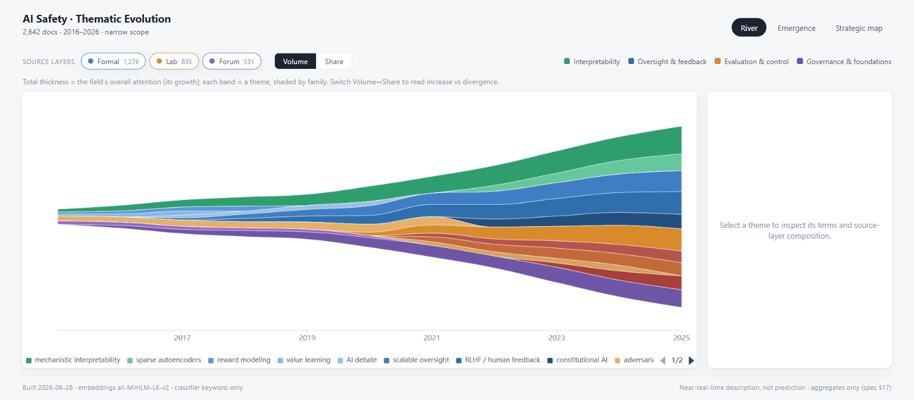
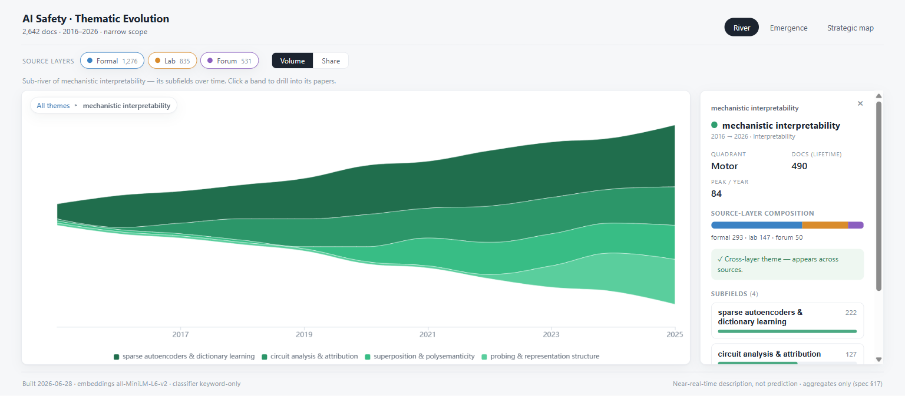
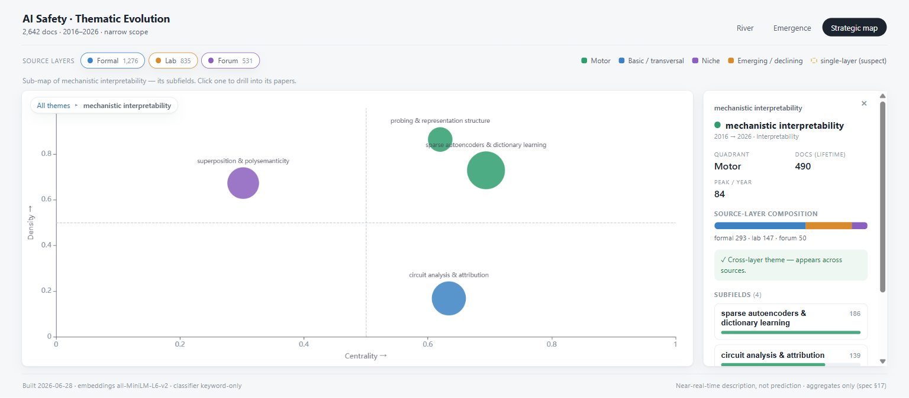
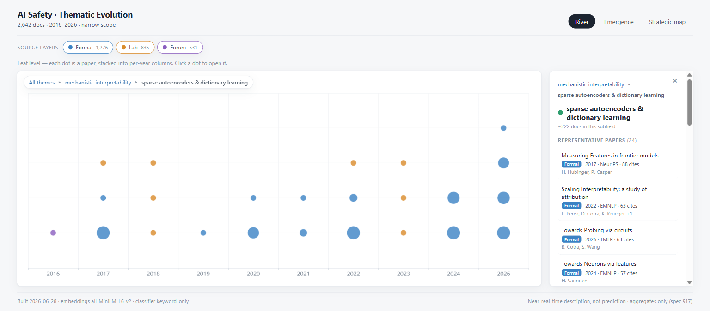

# AI Safety · Thematic-Evolution Map

A leading-edge science-mapping pipeline that renders **how attention to themes in
the AI safety research field has grown and diverged over time** — a streamgraph /
emergence "where is the field going" map spanning the *indexed* frontier
(arXiv / conference papers) and the *non-indexed* frontier (lab reports,
Alignment Forum / LessWrong). Published as a static, read-only SPA deployable on
Netlify.

This repository implements the v0.2 working specification. Section references
below (`§n`) point at that spec.



---

## Two decoupled tiers (§3)

```
TIER A — OFFLINE COMPUTE (Python; your machine or CI — NEVER on Netlify)
  ingest → normalize → filter(keyword+LLM) → dedup → embed(BERTopic)
        → temporal slicing → thematic-evolution compute → public/data/*.json

TIER B — NETLIFY (hosts the app)
  static SPA on CDN → fetches /data/*.json → renders streamgraph + emergence + strategic maps
```

Netlify does **zero** data science. It serves files. The heavy pipeline emits
small JSON **aggregates** (a few hundred KB) that the front end renders entirely
client-side — no backend in the request path (§2c, §2e, §17).

---

## Quickstart

### 1. See the app now (no Python, no network, no keys)

```bash
npm install
npm run data        # writes demo artifacts to public/data (python pipeline/run.py --synthetic)
npm run dev         # open http://localhost:5173
```

`npm run data` runs the **synthetic** generator (`pipeline/synthetic.py`,
stdlib-only) so the SPA renders immediately. The storyline encodes known field
history for face validity (§18): interpretability sharpening into mechanistic
interpretability, sparse autoencoders splitting off, RLHF spawning constitutional
AI, agent-foundations declining and dying, evaluations / AI-control emerging.

### 2. Build the real corpus (Tier A)

```bash
cp .env.example .env          # set OPENALEX_EMAIL; optional ANTHROPIC_API_KEY
pip install -r pipeline/requirements.txt

python pipeline/run.py --phase 1            # MVP: Layer 1 (formal) only (§21)
python pipeline/run.py --phase 2 --no-llm   # + Alignment Forum, keyword-only filter
python pipeline/run.py --phase 2            # + LLM precision classifier (needs key)
```

Each run updates the offline DuckDB store and rewrites `public/data/*.json`.
Then `git push` → Netlify auto-deploys (§14, §16). See
[`pipeline/README.md`](pipeline/README.md) for the full Tier A guide.

### 3. Build the front end (Tier B)

```bash
npm run build       # tsc --noEmit + vite build → dist/
npm run preview     # serve the production build locally
```

---

## What the app shows (§15)

The lead question is *"how has attention to each theme grown and diverged over
the years?"* — a volume-over-time story, so the views are built around that
rather than a flow diagram.

| View | What it is |
|---|---|
| **River** | A **streamgraph** (the hero). Total thickness = the field's overall attention growth; each band = a theme lineage, shaded by **family** (interpretability / oversight / evaluation / governance). A **Volume ↔ Share** toggle reads the two halves of the question literally: *Volume* = attention increased, *Share* = attention diverged. |
| **Emergence** | A **bubble timeline** — one row per theme ordered by the year it emerged, bubbles sized by attention each year. Births on the left, growth rightward, fading rows trailing off. |
| **Strategic map** | Themes positioned by Callon **centrality × density**, split into motor / basic / niche / emerging quadrants (§11); bubble area ∝ attention. |

**All three views drill recursively and share one path.** Click a theme and the
chart zooms into that theme's *subfields* — a **sub-river** (River), a
**sub-timeline** (Emergence), or a **sub-map** (Strategic) — and clicking a leaf
subfield turns the chart into **dots** (one per paper). The drill level is shared
across views, so you can drill in one and switch tabs to compare the same level
elsewhere. A breadcrumb navigates back up.

**Recursive drill-down — the chart zooms in.** Clicking a theme zooms whichever
view you're in into that theme's subfields: a **sub-river** (River), a
**sub-timeline** (Emergence), or a **sub-map** (Strategic). Click a subfield and
— since it has no deeper subfields — the chart becomes **dots**: one dot per
paper, stacked into per-year columns, coloured by source layer and sized by
citations; click a dot to open it. A breadcrumb (`All themes ▸ mechanistic
interpretability ▸ sparse autoencoders…`) navigates back up, and the side panel
mirrors the same path in text (subfield list → paper list with authors, venue,
citations, links). The drill level is shared state, so switching tabs keeps you
at the same depth.

Each theme is a separate `themes/<key>.json` shard, **lazy-loaded only on click**
— so you get paper-level depth without ever shipping the whole corpus (§17). The
theme level also shows lifetime attention, peak year, family, and the
**source-layer composition audit** (cross-layer = robust, single-layer =
suspect, §12).





**Source-layer controls (§12).** Toggle formal / lab / forum. All filtering is
client-side over aggregates. The detail panel audits each theme by layer
composition: **cross-layer themes are flagged robust; single-layer themes are
flagged suspect** (they may reflect one venue's cadence rather than a field-wide
front).

---

## Load-bearing design decisions (§2)

- **Thematic evolution needs no citations.** Themes come from text
  (embeddings / co-word); flows come from topic overlap. Citation lag is
  irrelevant; submission-dated preprint text removes most of it.
- **Currency over cleanliness.** Preprints and informal sources are *embraced*
  to see the field 1–2 years earlier, accepting noisier data. Right for "where
  is it going"; wrong for "what is established."
- **Compute offline, deploy static.** The pipeline can't run on Netlify
  (function limits, no Python runtime — §14). It runs offline and commits JSON.
- **Python + JS, no R in the critical path.** Offline tier is Python (BERTopic).
  `bibliometrix` is an *optional* offline validation oracle only (§11, §18).
- **Ship aggregates, not raw records.** Per-document data stays in DuckDB and is
  never exported — this is what keeps the app deployable and scalable (§17).

## This is **not** a forecaster (§1, §19)

Preprint data removes lag, making the map *near-real-time* — not *ahead* of the
field. It describes emergence in progress. Genuine forecasting (link prediction,
topic-acceleration models) is a future extension (Appendix B), framed as
extrapolation.

---

## Repository layout (Appendix A)

```
pipeline/                 # TIER A (Python, offline)
  ingest/                 # openalex.py · forum.py · labs.py
  config.py schema.py db.py keywords.py
  normalize.py filter.py dedup.py embed.py
  thematic_evolution.py   # per-slice topics → cross-slice graph
  export.py               # write public/data/*.json (aggregates only)
  synthetic.py run.py requirements.txt
public/data/              # committed JSON artifacts (the only thing Netlify needs)
src/                      # TIER B front end (Vite + React + ECharts + TS)
netlify.toml              # static hosting config
.github/workflows/        # optional cron refresh
```

## Tech stack (§20)

- **Offline:** bertopic · sentence-transformers · umap-learn · hdbscan ·
  scikit-learn · pyalex · requests/bs4/feedparser · duckdb · anthropic (optional).
- **Front end:** Vite · React · ECharts (tree-shaken) · TypeScript.
- **Netlify:** static CDN hosting; functions/blobs optional and unused by default.

## Limitations to state in any write-up (§19)

Trailing not predictive · the non-indexed gap is only partly closed · source
heterogeneity introduces artifacts (mitigated by source tags, not eliminated) ·
selection bias is owned not neutral (boundary / lab list / tag / date choices
shape the result) · API & scraping fragility need maintenance · no live
per-document query by design (§17).
